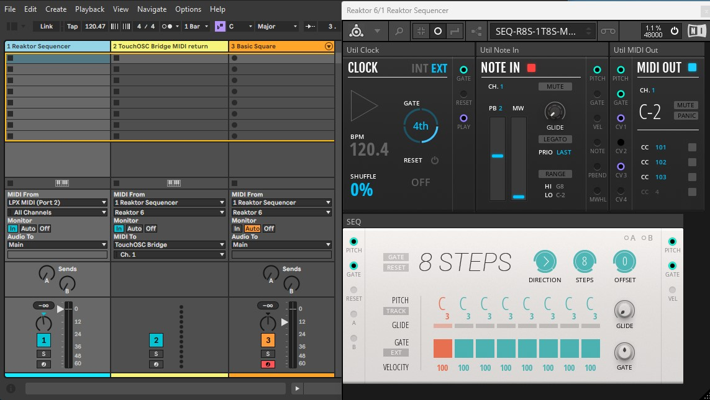

## Reaktor 8 STEPS Sequencer TouchOSC template
- Instrument: Reaktor 8 STEPS Sequencer, 1 track, 8 steps, MIDI out, Hosted / Standalone
- Model: SEQ-R8S-1T8S-MHS
- Version: 1.2 
- 

 

## Contents
- [Description](#description)
- [Operation](#operation)
- [Instrument](#instrument)
- [Sequencer](#sequencer)
- [Reaktor rack](#reaktor-rack)
- [Connections](#connections)
- [Requirements](#requirements)
- [Download](#download)
- [License](#license)
- [Support the Author](#support-the-author)

## Description
A simple and easy to use TouchOSC template to control a Reaktor 8 STEPS Sequencer virtual instrument. It can be used to jam and inspire your productions. The template sends the transport and sequencer values. The sequencer in turn sends the midi sequence to other virtual or external instruments.  A return track from the DAW sends back midi CC messages to visualize the position steps for an interactive experience. It "materializes" a small and basic "physical" sequencer for your musical production workflow.  

## Operation
The template can be used in 3 modes:

### Mode 1: Reaktor running as a plugin hosted in Ableton
This is the straightforward mode to use the template. The repository includes an Ableton live set file already configured with the internal MIDI routing and MIDI mapping for a quick start. You could later add an External Instrument or CV instrument track to send MIDI to an external synth or CV to a modular eurorack. 

 

 

### Mode 2: Reaktor running as a plugin hosted in other DAW
This mode is similar to mode 1, using other DAW that supports **internal MIDI routing for plugins.** (no sample file included). Some of the DAWs known to support this functionality are: Bitwig, Cubase, FL Studio, Reaper, and Digital Performer. Each DAW handles MIDI routing slightly differently, so how you route MIDI between plugins may require specific setup steps in each environment. Load the Reaktor plugin in your DAW and use the rack (preset) file included in the repository. Configure in your DAW the MIDI mapping for the transport controls (play/stop/BPM) and adjust the BPM scaling. 

> [!IMPORTANT]
> **Add a MIDI track in your DAW for the TouchOSC Bridge MIDI return. MIDI in receives CC´s from Reaktor´s track, MIDI out sends CC´s to TouchOSC Bridge. See the Ableton´s example below in [download](#download) to compare.  

 

### Mode 3: Reaktor running in Standalone Mode outside the DAW
Run Reaktor in standalone mode outside of your DAW and load the rack (preset) file included in the repository. Enable "Sync to External Clock" in Reaktor to receive clock from your DAW and enable clock send in your DAW. Run a virtual midi port in your computer to communicate Reaktor with your DAW (loopMIDI recommended) and do the necessary midi port configurations and routing. Configure in your DAW the MIDI mapping for the transport controls (play/stop/BPM) and adjust the BPM scaling. 

 

 

### Sync and takeover limitations
As long as your template and your DAW session are open, both are in sync. But once you close any of them, further changes will lose sync. To keep it in sync, it is recommended to manually save your template and DAW session simultaneously before closing, to keep your session and continue working later by recalling them. Also be aware that the template uses "absolute" scaling, so you occasionally will need to move the controllers to pick up the correct value.

 

## Instrument
- Plugin: Native Instruments - Reaktor 6 
- Library: Blocks Base
- Main Module: SEQ-Bento 8 Steps Sequencer
- Operation Mode:  **hosted** or Standalone
- DAW Host:  Ableton Live or other DAWs that support internal MIDI routing for plugins.

## Sequencer
- Tracks: 1 track 
- Steps: 8 steps, melodic sequencer
- MIDI out: Pitch, gate (with velocity level)
- Modulation: Velocity, Gate time, Glide
- 6 Sequencer directions: 
	- fwd > 
	- rev < 
	- fwd-rev (Pendulum) <>
	- ping-pong <<>> 
	- brownian (semi-random) ?
	- random (full-random) ?!
- Offset: initial position of sequence
- Reset: reset to initial position 
- Transpose: pitch track using an external midi controller
- Clock: External - Ableton Link (Ableton hosted mode), External Sync Clock (Standalone mode) 
- MIDI CC out: CC101 (gate), CC102 (position), CC103 (play)

 

## Reaktor rack
- Blocks: BENTO Box
- Important note: The rack uses a "hidden twin" sequencer to track position and return CC102 to the template. Do not erase or change the values. 

 

## Connections
- Reaktor Mapping: OSC
- DAW Host Mapping:  MIDI
- TouchOSC Connections 
	- MIDI: Bridge
	- OSC: Host (IP of PC host), Ports: send 10000, receive 10000
	- Bridge: Host(IP of PC host)

## Requirements
- Control surface software: TouchOSC
- Tablet: An iOS or Android Tablet
- DAW: Ableton Live or other DAWs that supports internal MIDI routing for plugins
- Plugin: Native Instruments - Reaktor 6
- Reaktor Modular Blocks: Blocks Base
- Target virtual instrument: Any virtual instrument in your DAW
- Target external instrument:  Any external midi instrument 
- Optional external MIDI controller: For pitch transpose

## Download
Download the following files to use the template:
- TouchOSC Template:    [SEQ-R8S-1T8S-MHS-1.2.tosc](files/SEQ-R8S-1T8S-MHS-1.2.1.tosc)
- Reaktor Rack:         [SEQ-R8S-1T8S-MHS-1_2.nksr](files/SEQ-R8S-1T8S-MHS-1_2.nksr)
- Ableton Live set:     [SEQ-R8S-1T8S-MHS-1.2.als](files/SEQ-R8S-1T8S-MHS-1.2.als)
	- Track 1 - Reaktor sequencer: Reaktor 8 STEPS, MIDI in receives transpose, MIDI out sends to track 2 and track 3.
	- Track 2 - TouchOSC Bridge MIDI return: MIDI in receives CC´s from track 1, MIDI out sends CC´s to TouchOSC Bridge 
	- Track 3 - Basic Square: A sample Ableton stock virtual instrument to start playing, MIDI in from track 1. 

 

## License

All assets and code are under the MIT LICENSE in the public domain unless specified otherwise.

---

## Support the Author

 
I'm passionate about creating code that brings joy, inspiration, and creativity into people's lives. If you've enjoyed what I share and want to support my work, your contribution will help me to continue building. Every little bit fuels my creativity.

**_Thank you for your kindness and support!_** 

