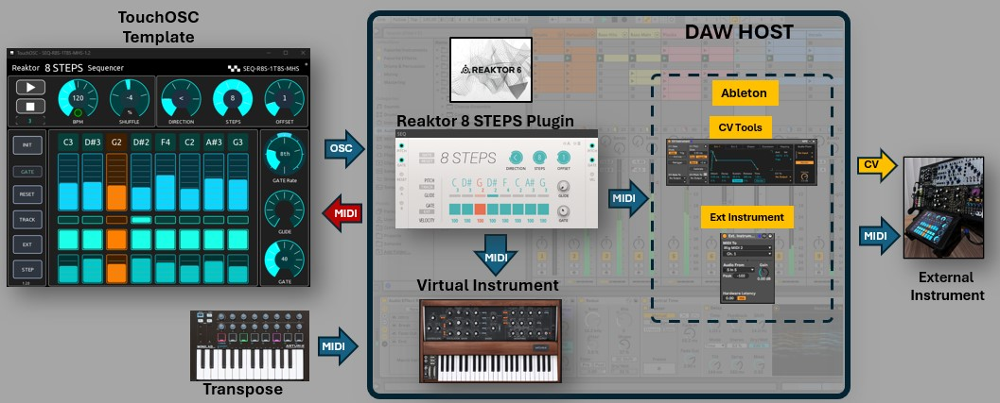

## Reaktor 8 STEPS Sequencer TouchOSC template
- Instrument: Reaktor 8 STEPS Sequencer, 1 track, 8 steps, MIDI out, Hosted in DAW
- Model: SEQ-8S-1T8S-MH
- Version: 1.2

 

## Description
A basic and easy to use TouchOSC template to control a Reaktor 8 STEPS Sequencer virtual instrument. It can be used in a simple setup to jam, improvise and inspire your productions. The template sends the transport and playing values. The sequencer in turn sends the midi sequence to other hosted instruments in your DAW.  A return track sends back midi CC messages to visualize the position steps for an interactive experience. It "materializes" a small and basic "physical" sequencer for your musical production workflow to play virtual instruments or even an external modular gear by using it with Ableton CV tools.

 

---

## Contents
- [Instrument](#instrument)
- [Sequencer](#sequencer)
- [Connections](#connections)
- [Requirements](#requirements)
- [Files](#files)
- [License](#license)
- [Support the Author](#support-the-author)

## Instrument
- Plugin: Native Instruments Reaktor 6 
- Library: Blocks Base
- Main Module: SEQ-Bento 8 Steps Sequencer
- Operation Mode:  **hosted** in Ableton Live
- DAW Host:  Ableton Live 11/12

## Sequencer
- Modular Block: Reaktor Bento Box 8 STEPS
- Tracks: 1 track 
- Steps: 8 steps, melodic sequencer
- MIDI out: Pitch, gate (with velocity level)
- Modulation: Velocity, Gate time, Glide
- 6 Sequencer directions: 
	- fwd > 
	- rev < 
	- fwd-rev (Pendulum) <>
	- ping-pong <<>> 
	- brownian (semi-random) ?
	- random (full-random) ?!
- Offset: initial position of sequence
- Reset: reset to initial position 
- Pitch track: transpose using an external midi controler
- Clock: External, Ableton Link 
- MIDI CC out: CC101 (gate), CC102 (position), CC103 (play)

 

## Connections
- Reaktor Mapping: OSC
- Ableton Host Mapping:  MIDI
- Connections - MIDI: Bridge
- Connections - OSC: Host, Ports: send 10000, receive 10000
- Bridge: IP of your PC host
- Setup: 
	- Bridge: IP of your PC host
	- OSC: IP of your PC host
	- Ableton Live MIDI settings: TouchOSC Bridge Input Port (Track, Remote), Output Port (Track, Sync, Remote)

## Requirements
- Control surface software: TouchOSC
- Tablet: An iOS or Android Tablet
- DAW: Ableton Live Version 11/12
- Plugin: Native Instruments - Reaktor 6
- Reaktor Modular Blocks: Blocks Base
- Target virtual instrument: Any virtual instrument in your DAW
- Target external instrument:  Any external midi instrument using midi out or Ableton CV tools (optional)
- Optional external MIDI controller: Pitch transpose

## Files
- TouchOSC Template: SEQ-8S-1T8S-MH-1.2.tosc
- Reaktor Rack:      SEQ-8S-1T8S-MH-1.2.nksr
	- Important note: The rack uses a "hidden twin" sequencer to track position and return CC102 to the template. Do not change.
- Ableton Live set:  SEQ-8S-1T8S-MH-1.2.als
	- Track 1 - Reaktor sequencer: Reaktor 8 STEPS rack (preset), MIDI in receives transpose, MIDI out sends to track 2 and track 3.
	- Track 2 - TouchOSC Bridge MIDI return: MIDI in receives CC´s from track 1, MIDI out sends CC´s to TouchOSC Bridge 
	- Track 3 - Basic Square: A sample Ableton stock virtual instrument to start playing, MIDI in from track 1. 

 

## License

All assets and code are under the MIT LICENSE in the public domain unless specified otherwise.

---

## Support the Author

 
I'm passionate about creating code that brings joy, inspiration, and creativity into people's lives. If you've enjoyed what I share and want to support my work, your contribution will help me to continue building. Every little bit fuels my creativity.

**_Thank you for your kindness and support!_** 

