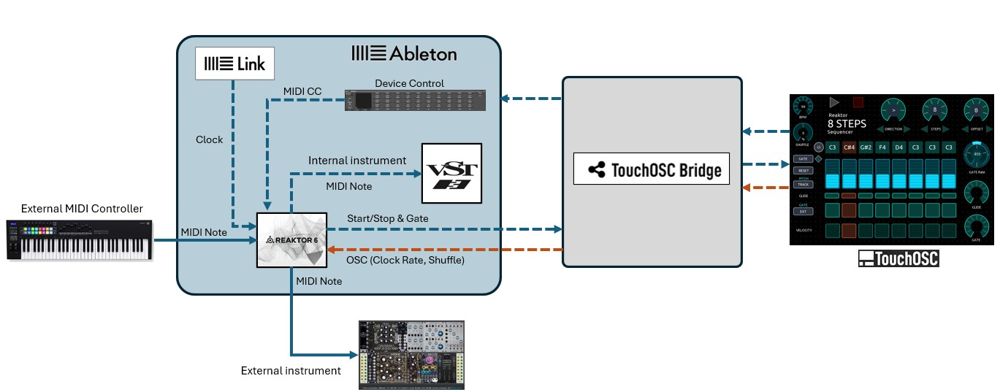
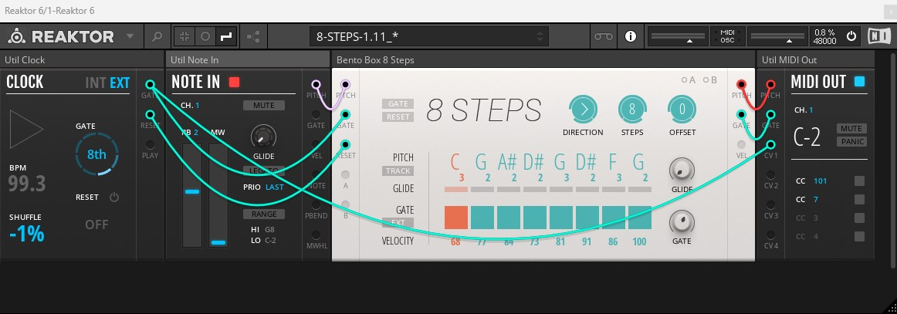
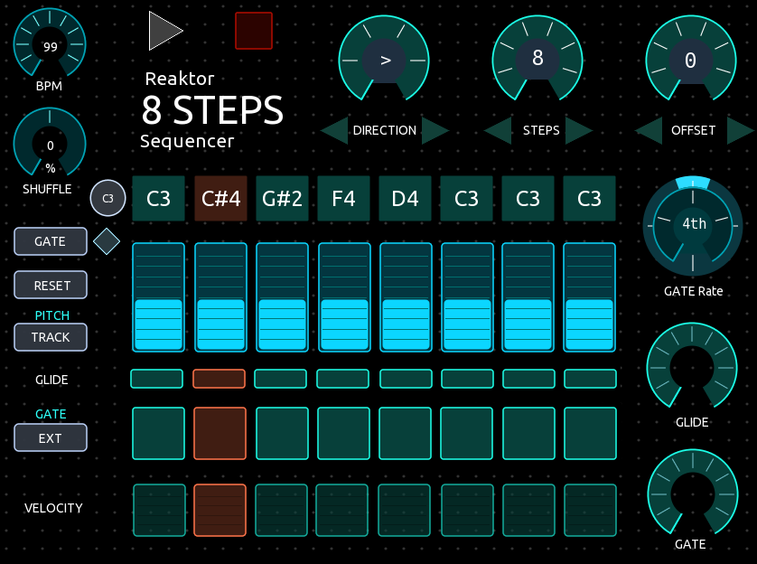

## REAKTOR 8 STEPS SEQUENCER CONTROLLER - TouchOSC template

This is a TouchOSC template for a Reaktor 8 STEPS Sequencer that materializes a small "physical" sequencer for your musical production workflow. You can use your hands-on to play and control a REAKTOR 8STEPS sequencer to play your Ableton virtual instruments or also an external modular gear using Ableton CV tools. The template follows and light the sequence steps on sync, providing an inspiring visual and interactive experience.

---
## Contents
- [Specifications](SPECS.md)
- [Requirements](#requirements)
- [Connections](#connections)
- [Features](#features)
- [Instructions](#instructions)
- [Notes](#notes)
- [Download files](#Download-files)

---

 

---

### Requirements
-   TouchOSC and TouchOSC Bridge
-   An iOS or Android Tablet
-   Ableton Live Version 11 or 12
-   Reaktor 6 (Player or Full), with Blocks Base
-   A MIDI controller for external pitch
-   A virtual instrument in your DAW
-   An external instrument with Ableton CV Instrument (optional)

---

### Connections
The template is designed to work with Reaktor 6 ***hosted*** inside Ableton Live. You can use it to play a sequence either to a virtual instrument (VST plugin) or to an external instrument (MIDI or CV Tools). An important consideration for the design was the use of Ableton Link to keep the clock synchronization of the sequencer steps with the TouchOSC controller.

Ableton Live provides midi feedback to the TouchOSC template using a [device control mapping](images/img4.Ableton_Reaktor_Device_Controller.jpg). This allows bidirectionality and automatic update of each control when you change it either in the TouchOSC template or in the Reaktor plugin. The Ableton Live template has all the [midi mappings](images/img9. Ableton-MIDI-map.jpg) already configured. Ableton Live send and receives MIDI signals through [TouchOSC Bridge](images/img5.TouchOSC_Bridge_config.jpg)configured with the Track, Sync and the Remote-control options.

---

### Features
The template has all the functions of the BLOCKS REAKTOR 8 STEPS sequencer, an accurate reproduction of the original virtual instrument. Additionally, it follows the sequence steps on sync, lighting each step and giving a visual and interactive experience. The template scripts contain carefully crafted algorithms to match the sequencer steps progression with the gate and start/stop midi signals.  The complete wiring of the Reaktor rack preset is as follows: 

The template also includes additional controls to enhance the functionality:

- C3 button – to center all the steps to C3
- Manual Gate (diamond button) – to play a manual gate to easy adjust the pitch on each step. 
- Play button – To start the sequencer, synchronized with Ableton Link on the beat.
- Stop button - To stop the sequencer.
- Clock Gate button –Allows you to set the number of gates sent for every beat
- Clock Shuffle button – To add shuffle or swing.

Just two [OSC mappings](images/img7.Reaktor_OSC_map.jpg) are used in Reaktor, which are already configured in the Reaktor rack preset. The controller makes use of [arrows buttons](images/img8.Direction-Steps-Offset.png) to control the direction, steps and offset instead of the radial control directly. The reason was to prevent out-of-sync jumps when touching the radial controls that creates a bouncing effect on x values.

---

### Instructions
1. Load the TouchOSC template in your Tablet.
2. Check you have enabled and working the MIDI, OSC, and Bridge connections.
3. Configure in your tablet the OSC and Bridge connections with the host IP of your computer running TouchOSC Bridge. 
4. Load the Ableton Live set and the Reaktor preset files in your computer. 
5. Start the Ableton Live set. The first time, you would need to update the Reaktor preset location by selecting it from your file directory. Then save your live set. 
6. Enable Ableton Link
7. Check you have the TouchOSC Bridge configured in Ableton as required.
8. Check the MIDI/OSC connections are working as pictured in the setup diagram.
9. The first time you run the template try moving all the controls to pick-up the controls. 
10. Select a virtual instrument of your choice in another Ableton track (or an external instrument) and select Reaktor 6 as the MIDI input to receive the sequencer output. 
11. Configure your sequence as you wish: direction, steps, offset, velocity, glide, gate, gate rate, bpm and so on
12. You are ready to play. Enjoy!

---

### Notes

  
  

**PLAY**. Once you press the PLAY button your sequence start playing. You can change any parameter of the template while running as you wish. The template will keep on sync with the beat. 

**RESET**. Although the template controller is designed to keep on sync all the time, occasionally it could loose sync, depending on the connection’s latency and the CPU and tablet resources. Just press the RESET button and it will recover. This would probably happen when you select high gate rates 32th or 64th or high BPMs. 

**C3**. A C3 button is provided to center the pitch off all steps. This is useful when you are starting to set-up a new sequence from scratch.
Manual Gate. A diamond shaped button is provided to trigger a manual gate to move one step. This is useful when you are starting to set-up a new sequence from scratch to test the sequence.

**GATE**. Internally the gate control is limited to 100 (not 127), to prevent overlapping of notes that could produce loose of sync. 

**GLIDE**. The glide control produces slides to the pitch of the following played note, creating a “portamento” or “glissando” effect. Take care, it could produce out of scale notes.

**MIDI OUT CC 101**. This is an important midi signal that the template uses for gate control. Do not unintentionally unwire it, to prevent your template to fail. 

**RACK PRESET MODIFICATIONS**. You can of course modify and add any blocks you wish to your Reaktor rack. For example, you could want to add a quantizer, a clock divider or some utility blocks. The only constraint is to keep the essential wiring on place of the original preset. 

---

### Download files
The following files are included in the repository to quickly setup and run the template.  
| File | Description   |
| ------------ | ------------ |
| [Reaktor 8STEPS - 1.11.tosc](touchosc/Reaktor-8STEPS-1.11.01.tosc) | The TouchOSC template to control the Reaktor 8Steps Sequencer  |
| [Reaktor-8 STEPS-1.11.als](files/Reaktor-8-STEPS-1.11.als)   | The Ableton Live Template   |
| [8-STEPS-1.11.nksr](files/8-STEPS-1.11_.nksr)  | The Reaktor 8Steps rack file with modular blocks and wiring |

---

### Support the Author

 
I'm passionate about creating code that brings joy, inspiration, and creativity into people's lives. If you've enjoyed what I share and want to support my work, your contribution will help me to continue building. Every little bit fuels my creativity.

**_Thank you for your kindness and support!_** 

---

